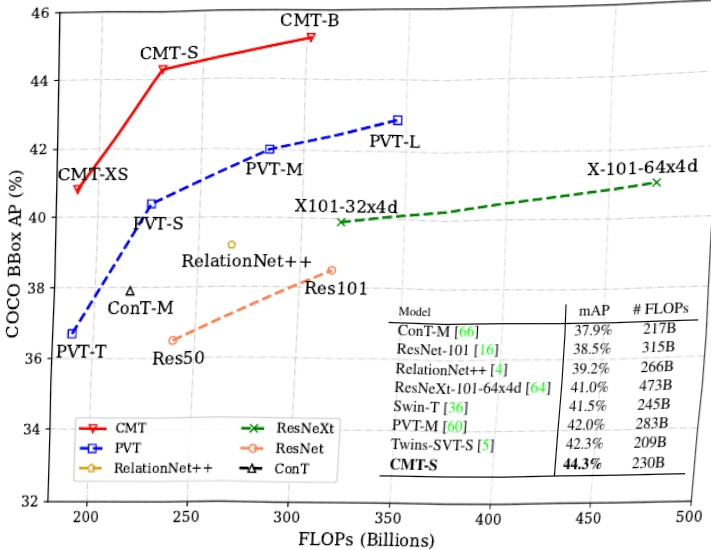
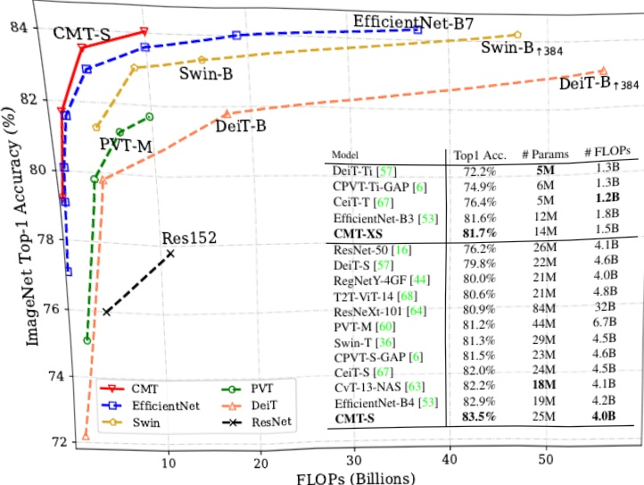

(b) COCO mAP vs. FLOPs 

Figure 1. Performance comparison between CMT and other models. (a) Top-1 accuracy on ImageNet [8]. (b) Object detection results on COcO val2017 [35] of different backbones using RetinaNet framework, all numbers are for single-scale,$ \text{"}1x\text{"}$ training schedule.

(a) ImageNet Accuracy vs. FLOPs 

then fed into a stack of CMT blocks for representation learning. Specifically, the introduced CMT block is an improved variant of transformer block whose local information is enhanced by depth-wise convolution. Compared to ViT [10],the features generated from the first stage of CMT can maintain higher resolution, i.e.,$H/4{\times}W/4$ against $H/16{\times}W/16$ in ViT, which are essential for other dense prediction tasks.Furthermore, we adopt the stage-wise architecture design similar to CNNs [16,46,53] by using four convolutional layer with stride 2, to gradually reduce the resolution (sequence length) and increase the dimension flexibly. The stage-wise design helps to extract multi-scale features and alleviate the computation burden caused by high resolution. The local perception unit (LPU) and inverted residual feed-forward network (IRFFN) in CMT block can help capture both local and global structure information within the intermediate features and promote the representation ability of the network. Finally, the average pooling is used to replace the class token in ViT for better classification results. In addition, we propose a simple scaling strategy to obtain a family of CMT variants.Extensive experiments on ImageNet and other downstream tasks demonstrate the superiority of our CMT in terms of accuracy and FLOPs. For example, our CMT-S achieves 83.5% ImageNet top-1 with only 4.0B FLOPs, while being 14x and 2x less than the best existing DeiT [57] and Effi cientNet [53], respectively. In addition to image classification,CMT can also be easily transferred to other vision tasks and serve as a versatile backbone. Using CMT-S as the backbone,RetinaNet [34] can achieve 44.3% mAP on COCO val2017,outperforming the PVT-based RetinaNet [60] by 3.9% with less computational cost.

### 2. Related Work 

The computer vision community prospered in past decades riding the wave of deep learning, and the most popular deep neural networks are often built upon basic blocks, in which a series of convolutional layers are stacked sequentially to capture local information within intermediate features. However, the limited receptive field of small convolutional kernels makes it diffi cult to obtain global information, withholding the networks of high performance on challenging tasks such as classification, object detection, and semantic segmentation. Therefore, many researchers start to dig deeper into self-attention based transformers which have the ability to capture long-range information. Here we briefly review the conventional CNNs and recently proposed vision transformers.

Convolutional neural networks. The first standard CNN was proposed by LeCun et al. [32] for handwritten character recognition, and the past decades have witnessed that many powerful networks [16,22,31,47,51] achieved unprecedented success on large scale image classification task[8]． AlexNet[31] andVGGNet[47]showedthat a deep neural network composed of convolutional layers and pooling layers can obtain adequate results in recognition. GoogleNet [51] and InceptionNet [52] demonstrated the effectiveness of multiple paths within a basic block.ResNet [16] showed better generalization by adding shortcut connections every two layers to the base network. To alleviate the limited receptive fields in prior research, some researches [20,21,41,45,59,62] incorporated attention mechanisms as an operator for adaptation between modalities.Wang et al. [59] proposed to stack attention modules sequentially between the intermediate stages of deep residual networks. SENet[21] and GENet [20] adaptively recalibrated channel-wise feature responses by modeling interdependencies between channels. NLNet [61] incorporated the self-attention mechanism into neural networks, providing pairwise interactions across all spatial positions to augment the long-range dependencies. In addition to above archi