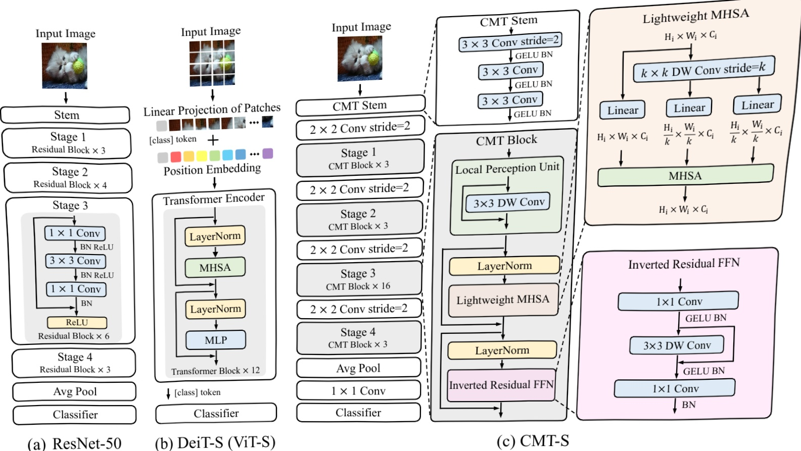

Figure 2. Example of the CMT-S architecture. (a) ResNet-50[16].(b) DeiT-S[57] (ViT-S[10]) architecture, where MHSA denoes the multi-head self-attention module. (c) The proposed CMT-S, described in Sec.3. More details and other variants are shown in Table 1.

DWConv(·) denotes the depth-wise convolution.

Lightweight Multi-head Self-attention. In original selfattention module, the input $\mathbf{X}\;\in\;\mathbb{R}^{n\times d}$ is linearly transformed into query $\mathbf{Q}\in\mathbb{R}^{n\times d_{k}}$ :,key $\mathbf{K}\in\mathbb{R}^{n\times d_{k}}$ , and value $\mathbf{V}\in\mathbb{R}^{n\times d_{v}}$ ',where $n=H\times W$ is the number of patches.And we omit the reshape operation from $H\times W\times d\mathrm{t o}n\times d$ of tensors in Figure $2(\mathbf{c})$ for simplicity. The notation $d,d_{k}$ and $d_{v}$ are the dimensions of input, key (query) and value,respectively. Then the self-attention module is applied as:

$$\operatorname{A t t n}(\mathbf{Q},\mathbf{K},\mathbf{V})=\operatorname{S o f t m a x}(\frac{\mathbf{Q K}^{T}}{\sqrt{d_{k}}})\mathbf{V}.$$

To mitigate the computation overhead, we use a $k\times k$ depth-wise convolution with stride k to reduce the spatial size of K and V before the attention operation,$i.e.$ ,

$\mathbf{K}^{\prime}=\operatorname{D W C o n v}(\mathbf{K})\in\mathbb{R}^{\frac{n}{k^{2}}\times d_{k}}\operatorname{a n d}\mathbf{V}^{\prime}=\tilde{\operatorname{D W C o n v}}(\mathbf{V})\in$ $\mathbb{R}^{\frac{n}{k^{2}}\times d_{v}}$ as shown in Figure $2(\mathbf{c})$ . In addition, we add a relative position bias B to each self-attention module, and the corresponding lightweight attention is defined as:

$$\mathrm{L i g h t A t t n}(\mathbf{Q},\mathbf{K},\mathbf{V})=\mathrm{S o f t m a x}(\frac{\mathbf{Q}\mathbf{K}^{\prime T}}{\sqrt{d_{k}}}+\mathbf{B})\mathbf{V}^{\prime}.$$

where $\mathbf{B}\in\mathbb{R}^{n\times\frac{n}{k^{2}}}$ is randomly initialized and learnable.The learnt relative position bias can also be easily transferred to $\mathbf{B}^{\prime}\;\in\;\mathbb{R}^{\widetilde{m_{1}}\times m_{2}}$ with a different size $m_{1}\times m_{2}$ I through bicubic interpolation, i.e.,$\mathbf{B}^{\prime}=\mathrm{B i c u b i c}(\mathbf{B})$ . Thus it is convenient to fine-tune the proposed CMT for other downstream vision tasks. Finally, the lightweight multi-head self-attention (LMHSA) module is defined by considering h "heads",$i.e.$ ,h LightweightAttention functions are applied to the input. Each head outputs a sequence of size $\begin{array}{r}{n\times\frac{d}{h}}\end{array}$ . These h sequences are then concatenated into $\mathbf{a}\;n\times d$ sequence.

Inverted Residual Feed-forward Network. The original FFN proposed in ViT [10] is composed of two linear layers separated by a GELU activation [18]. The first layer expands the dimension by a factor of 4, and the second layer reduces the dimension by the same ratio:

$$\mathrm{F F N}(\mathbf{X})=\mathrm{G E L U}(\mathbf{X}W_{1}+b_{1})W_{2}+b_{2}.$$

where $W_{1}\in\mathbb{R}^{d\times4d}$ and $W_{2}\in\mathbb{R}^{4d\times d}$ indicate weights of the two linear layers, respectively. The notation $b_{1}$ and $b_{2}$ are the bias terms. Figure 2(c) provides a schematic visualization of our design. The proposed inverted residual feed-forward network (IRFFN) appears similar to inverted residual block [46] consisting of an expansion layer followed by a depth-wise convolution and a projection layer. Specifically, we change the location of shortcut connection for better performance:

$$\begin{aligned}{\operatorname{I R F F N}(\mathbf{X})}&{{}=\operatorname{C o n v}(\mathcal{F}(\operatorname{C o n v}(\mathbf{X}))),}\\ {\mathcal{F}(\mathbf{X})}&{{}=\operatorname{D W C o n v}(\mathbf{X})+\mathbf{X}.}\\ \end{aligned}$$

where the activation layer is omitted. We also include the batch normalization after the activation layer and the last 